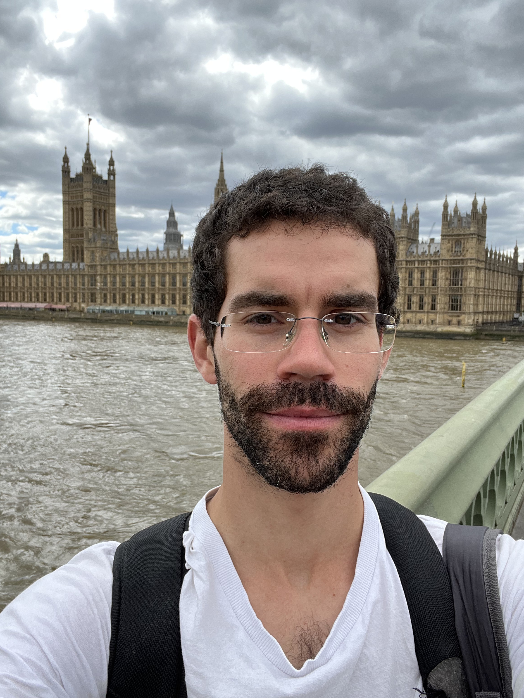

### About me
* PhD student in the University of Minho
* Also affiliated to INESC-TEC

### Research Area
* Semantics of concurrent quantum languages

### Publications
[[Technical report Event Structures]({{ site.url }}//docs/es.pdf)]

### Supervision
* Maria Inês Machado (2023; co-supervision)

