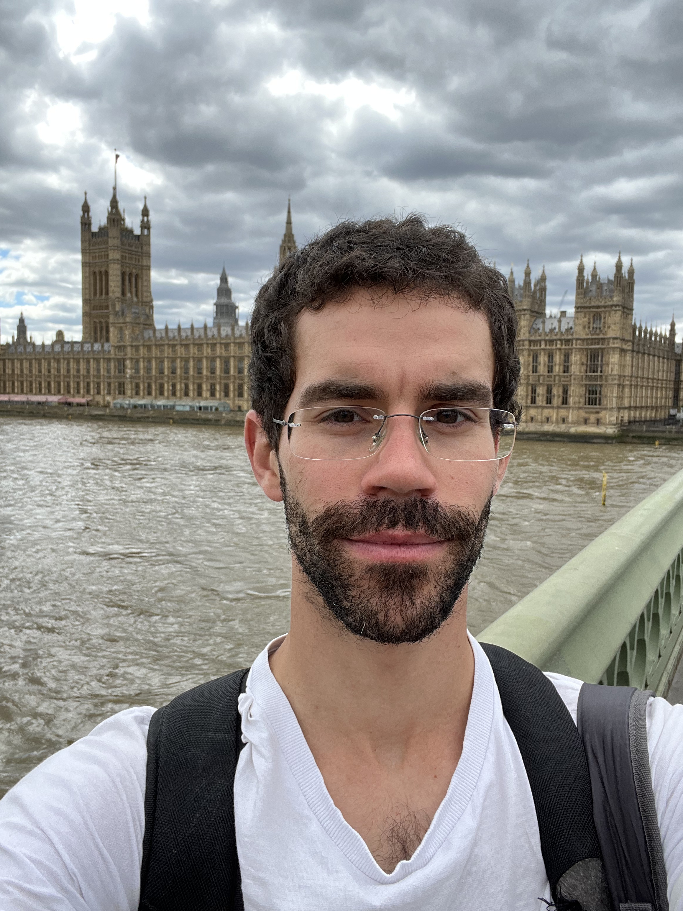

# Vítor Fernandes

I am a PhD student in Computer Science at the University of Minho. My research focuses on the semantics of programming languages with concurrent, probabilistic, and/or quantum features.

My work combines denotational and operational semantics, event structures, and the implementation of small imperative-style programming languages in Haskell. I am particularly interested in languages with C-like syntax and in using interpreters to support reasoning about programs.

I hold an MSc degree in Physics Engineering, with a specialization in Physics of Information. I have also taught C programming and Quantum Logic as an invited lecturer at the University of Minho.

Currently, I am deepening my knowledge of Python and several tools and DSLs for quantum programming, including [Qiskit](https://www.ibm.com/quantum/qiskit), [PennyLane](https://pennylane.ai/), [Cirq](https://quantumai.google/cirq), and [Qrisp](https://qrisp.eu/index.html).

Most of my learning projects and experiments are available in the [playground section of my GitHub](https://github.com/vegf17/playground).

---

## Research Interests

My research interests lie at the intersection of programming language semantics, concurrency theory, probabilistic computation, and quantum programming languages.

* Semantics of concurrent programming languages with probabilistic and/or quantum effects
* Event structures as denotational models for concurrent languages
* Operational semantics for imperative-style programming languages
* Quantum programming languages and quantum computation
* Interpreters in Haskell for simple programming languages